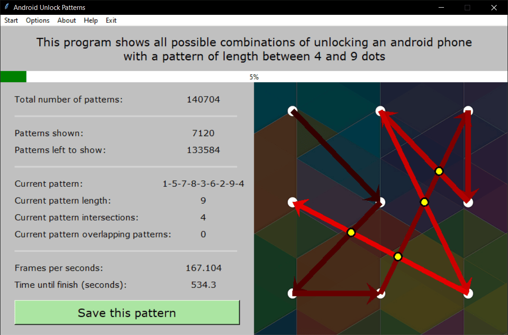

**See [releases](https://github.com/ChrisRoss5/patterns/releases/latest) to download the executable. Only tested on Windows 10.**

## Goals

- Learning permutations.
- Expanding my knowledge on Python.
- Practicing with Tkinter module and testing its limits.
- Testing the power of CPU and its usage.
- Learning SMTP protocol and sending emails.

## Idea

Randomly saw [this video](https://www.youtube.com/watch?v=D9dXrKUCfO0&t=154s) on Youtube.
